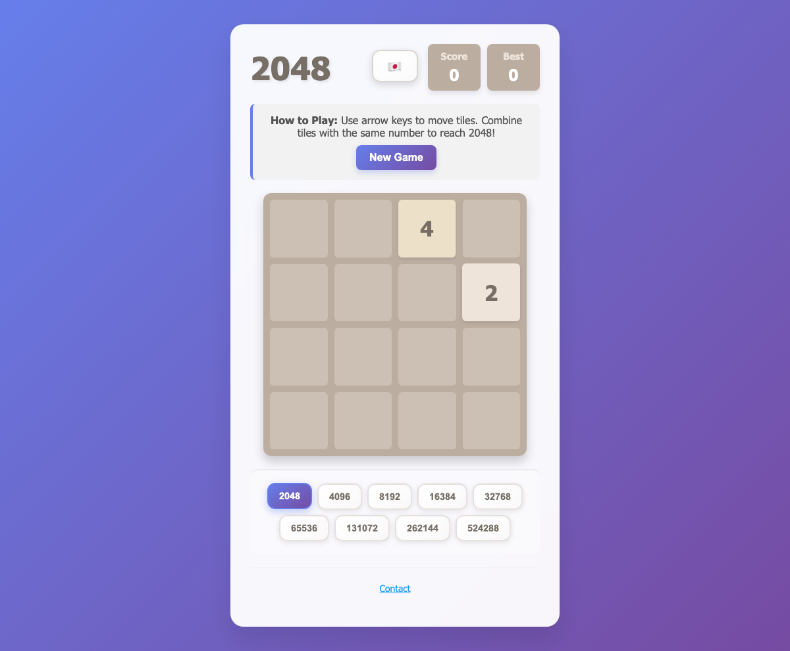

# 2048 Game

```
 

 ██████╗   ██████╗  ██╗  ██╗  █████╗       ██████╗   █████╗  ███╗   ███╗ ███████╗
 ╚════██╗ ██╔═████╗ ██║  ██║ ██╔══██╗     ██╔════╝  ██╔══██╗ ████╗ ████║ ██╔════╝
  █████╔╝ ██║██╔██║ ███████║ ╚█████╔╝     ██║  ███╗ ███████║ ██╔████╔██║ █████╗  
 ██╔═══╝  ████╔╝██║ ╚════██║ ██╔══██╗     ██║   ██║ ██╔══██║ ██║╚██╔╝██║ ██╔══╝  
 ███████╗ ╚██████╔╝      ██║ ╚█████╔╝     ╚██████╔╝ ██║  ██║ ██║ ╚═╝ ██║ ███████╗
 ╚══════╝  ╚═════╝       ╚═╝  ╚════╝       ╚═════╝  ╚═╝  ╚═╝ ╚═╝     ╚═╝ ╚══════╝


```



A clean and intuitive 2048 game built with HTML, CSS, and TypeScript. Play directly in your browser with smooth animations and responsive design.

## 🎮 Game Overview

2048 is a puzzle game where you slide numbered tiles on a 4×4 grid to combine them and create a tile with the number 2048.

### Game Rules

1. Use arrow keys (or WASD) to move tiles in four directions
2. When two tiles with the same number touch, they merge into one with double the value
3. A new tile (2 or 4) appears randomly after each move
4. Reach the 2048 tile to win the game
5. Game ends when no moves are possible

## 🚀 Getting Started

### Development
```bash
npm install          # Install dependencies
npm run dev          # Start development server at http://localhost:5173
npm run build        # Build for production
npm run preview      # Preview production build
```

### Quick Play
1. Clone or download this repository
2. Open `index.html` in your browser
3. Start playing immediately!

## 🎯 Controls

### Keyboard
- **Arrow Keys**: Move tiles
- **WASD**: Alternative movement controls (W=up, A=left, S=down, D=right)
- **R or Space**: Reset game

### Mobile & Touch
- **Swipe**: Move tiles in any direction
- **"New Game" Button**: Reset the game

## ✨ Features

- **Responsive Design**: Works on desktop, tablet, and mobile
- **Modern UI**: Beautiful gradient backgrounds with smooth animations
- **Best Score Tracking**: Automatically saves high scores using localStorage
- **Intuitive Controls**: Support for both keyboard and touch input
- **Game State Management**: Win/lose detection with appropriate messaging
- **Multi-language Support**: English and Japanese translations
- **TypeScript**: Full type safety and modern development experience

## 🎨 Design Highlights

- **Beautiful Gradients**: Purple and blue gradient backgrounds
- **Color-coded Tiles**: Visually distinct colors for each number value
- **Smooth Animations**: Seamless tile appearance and merge animations
- **Glass Effects**: Modern backdrop-filter effects for depth

## 📱 Browser Compatibility

- **Modern Browsers**: Latest Chrome, Firefox, Safari, Edge
- **Mobile Devices**: iOS Safari, Android Chrome
- **Tablets**: iPad, Android tablets

## 🏆 Scoring System

- Points are awarded when tiles merge (equal to the resulting tile value)
- Best score is automatically saved to localStorage
- Scores persist between sessions

## 🔧 Technical Stack

- **TypeScript**: Type-safe development with modern ES6+ features
- **Vite**: Fast build tool and development server
- **HTML5**: Semantic markup structure
- **CSS3**: Grid Layout, Flexbox, and CSS animations
- **Web Workers**: Background processing for game logic
- **Local Storage**: Persistent score and settings storage

## 🧪 Testing

```bash
npm run test         # Run unit tests
npm run test:ui      # Run tests with UI
npm run test:e2e     # Run end-to-end tests
npm run typecheck    # Type checking
```

## 🚀 Deployment

The game can be deployed to any static hosting service:
- GitHub Pages
- Netlify
- Vercel
- Cloudflare Pages

## 🎪 Future Enhancements

- Sound effects and music
- Multiple difficulty modes (3×3, 5×5 grids)
- Online leaderboards
- Custom themes and color schemes
- Undo functionality
- Game statistics tracking

---

Enjoy the game! 🎉
