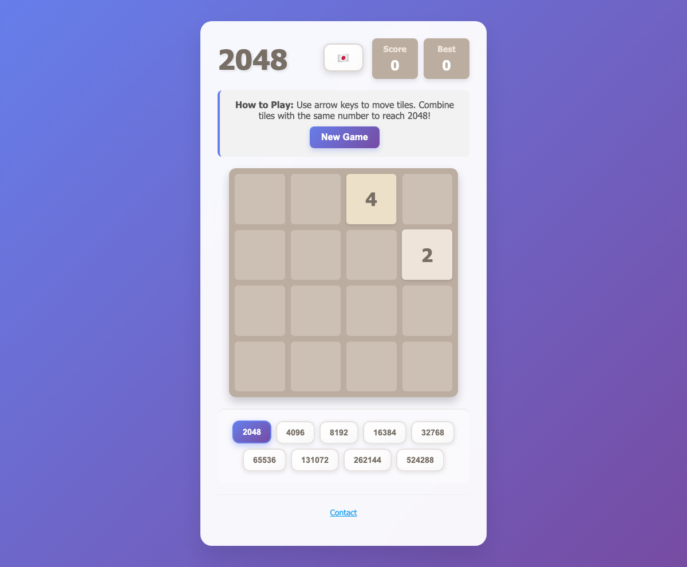

# 2048 Game


A clean and intuitive 2048 game built with HTML, CSS, and TypeScript. Play directly in your browser with smooth animations and responsive design.

## 🎮 Game Overview

2048 is a puzzle game where you slide numbered tiles on a 4×4 grid to combine them and create a tile with the number 2048.

### Game Rules

1. Use arrow keys (or WASD) to move tiles in four directions
2. When two tiles with the same number touch, they merge into one with double the value
3. A new tile (2 or 4) appears randomly after each successful move
4. Reach the selected target tile (2048 by default) to win the game
5. Game ends when no moves are possible

## 🚀 Getting Started

### Development
```bash
pnpm install         # Install dependencies
pnpm dev             # Start development server at http://localhost:5173
pnpm build           # Build for production
pnpm preview         # Preview production build
```

## 🎯 Controls

### Keyboard
- **Arrow Keys**: Move tiles
- **WASD**: Alternative movement controls (W=up, A=left, S=down, D=right)
- **R or Space**: Reset game

### Mobile & Touch
- **Swipe**: Move tiles in any direction
- **"New Game" Button**: Reset the game

## ✨ Features

- **Responsive Design**: Works on desktop, tablet, and mobile
- **Modern UI**: Beautiful gradient backgrounds with smooth animations
- **Best Score Tracking**: Automatically saves high scores using localStorage
- **Intuitive Controls**: Support for both keyboard and touch input
- **Game State Management**: Win/lose detection with appropriate messaging
- **Multi-language Support**: English and Japanese translations
- **TypeScript**: Full type safety and modern development experience

## 🎨 Design Highlights

- **Beautiful Gradients**: Purple and blue gradient backgrounds
- **Color-coded Tiles**: Visually distinct colors for each number value
- **Smooth Animations**: Seamless tile appearance and merge animations
- **Glass Effects**: Modern backdrop-filter effects for depth

## 📱 Browser Compatibility

- **Modern Browsers**: Latest Chrome, Firefox, Safari, Edge
- **Mobile Devices**: iOS Safari, Android Chrome
- **Tablets**: iPad, Android tablets

## 🏆 Scoring System

- Points are awarded when tiles merge (equal to the resulting tile value)
- Best score is automatically saved to localStorage
- Scores persist between sessions

## 🔧 Technical Stack

- **TypeScript**: Type-safe development with modern ES6+ features
- **Vite**: Fast build tool and development server
- **HTML5**: Semantic markup structure
- **CSS3**: Grid Layout, Flexbox, and CSS animations
- **Cloudflare Worker**: Static asset serving with an `index.html` fallback
- **Local Storage**: Persistent score and settings storage

## 🧪 Testing

```bash
# Unit Tests
pnpm test            # Run unit tests with vitest
pnpm test:ui         # Run tests with UI interface
pnpm test:run        # Run tests once without watch mode

# End-to-End Tests
pnpm test:e2e        # Run all e2e tests with Playwright
pnpm test:e2e:ui     # Run e2e tests with UI
pnpm test:e2e:debug  # Debug e2e tests
pnpm test:e2e:headed # Run e2e tests in headed mode
pnpm test:e2e:chrome # Run e2e tests in Chrome only
pnpm test:e2e:firefox # Run e2e tests in Firefox only
pnpm test:e2e:mobile # Run e2e tests on mobile browsers

# Type Checking
pnpm typecheck       # TypeScript type checking
```

## 🚀 Deployment

The repository is configured for deployment to Cloudflare Workers. Build the
assets with `pnpm build`, then deploy them with `pnpm exec wrangler deploy`.

## 🎪 Future Enhancements

- Sound effects and music
- Multiple difficulty modes (3×3, 5×5 grids)
- Online leaderboards
- Custom themes and color schemes
- Undo functionality
- Game statistics tracking

---

Enjoy the game! 🎉
